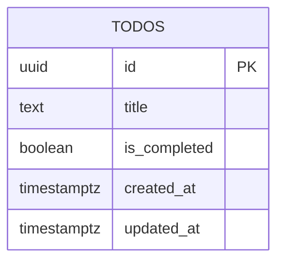

# Database Design (ERD) — Todo List App v4

Engine: PostgreSQL 16
Last updated: 2026-08-12
Source requirements: `docs/todos/SRS.md`

## 1. Overview

This schema stores persisted todo tasks for one shared no-login todo workspace. `todos` is the only aggregate root: task title, completion state, and stable created ordering. Login, users, sessions, profiles, categories, due dates, priorities, search metadata, and deleted-task recovery are deliberately out of database scope.

## 2. Diagram

Cardinality notation: `||` exactly one, `o|` zero or one, `}o` zero or many, `}|` one or many. Read left to right.

No relationships exist in this version. SRS explicitly excludes login, accounts, sharing, categories, collaboration, and cross-device identity sync.

## 3. Entities

### 3.1 `todos`

**Purpose** — Stores task rows shown in the single shared todo list. **Traces to** — TODOS-001, TODOS-002, TODOS-003, TODOS-004, TODOS-005.

| Column | Type | Null | Default | Unique | Description |
|---|---|---|---|---|---|
| `id` | `uuid` | no | `gen_random_uuid()` | PK | Surrogate task identifier used by toggle and delete actions. |
| `title` | `text` | no | none | no | Trimmed task title displayed to user. |
| `is_completed` | `boolean` | no | `false` | no | Completion state; new tasks start incomplete. |
| `created_at` | `timestamptz` | no | `now()` | no | Creation time used for stable saved task ordering. |
| `updated_at` | `timestamptz` | no | `now()` | no | Last modification time for add/toggle updates and future debugging. |

**Nullable columns** — none.

**Foreign keys**

| Column | References | On delete | On update | Why |
|---|---|---|---|---|
| none | none | n/a | n/a | No parent entities exist; app has no login or grouping scope. |

**Constraints**

| Name | Definition | Rule enforced |
|---|---|---|
| `ck_todos_title_length` | `CHECK (char_length(title) BETWEEN 1 AND 200)` | Persists only non-empty trimmed titles within SRS 200-character limit. |
| `ck_todos_title_trimmed` | `CHECK (title = btrim(title))` | Prevents bypassing backend trim rule and storing leading/trailing whitespace. |

**Indexes**

| Name | Columns | Type | Query it serves |
|---|---|---|---|
| `idx_todos_created_at_id` | `created_at`, `id` | btree | List tasks in stable saved order on page load: `ORDER BY created_at ASC, id ASC`. |

**Lifecycle** — hard delete. TODOS-004 says deleted tasks stay gone after refresh, SRS open question defaults to no recoverability, and no audit/reporting requirement needs soft delete.

## 4. Enumerations

No enumerations. Completion state is boolean because SRS allows only complete or incomplete.

| Name | Values | Mechanism | Why |
|---|---|---|---|
| none | n/a | n/a | No fixed multi-value domain exists. |

## 5. Access patterns

| # | Pattern | Frequency | Index used |
|---|---|---|---|
| 1 | Load task list in stable order: `SELECT id, title, is_completed, created_at, updated_at FROM todos ORDER BY created_at ASC, id ASC` | On page load and retry | `idx_todos_created_at_id` |
| 2 | Insert task with title and default incomplete state | Per add action | Primary key only; no lookup needed. |
| 3 | Toggle task by identifier: `UPDATE todos SET is_completed = $1, updated_at = now() WHERE id = $2 RETURNING ...` | Per toggle action | `todos_pkey` |
| 4 | Delete task by identifier: `DELETE FROM todos WHERE id = $1` | Per delete action | `todos_pkey` |

## 6. Data volume and growth

| Table | Rows at launch | Growth | Retention |
|---|---|---|---|
| `todos` | 0 | Low; user-created tasks only | Until user deletes task; hard delete removes row. |

No table is expected to exceed 10M rows within a year for minimal shared todo app scope. No partitioning or archival needed.

## 7. Integrity, privacy, and security

- Database enforces task identifier uniqueness, required title, title length, trimmed title, required completion state, and timestamps.
- Application enforces request JSON shape, trims title before insert, controls duplicate in-flight writes, and maps database errors to generic user-facing errors.
- Stored data is limited to task titles, completion state, and ordering metadata per SRS privacy requirement.
- `title` may contain user-entered text but is not account/profile data. Retention lasts until user deletes task.
- No secrets are stored in database.
- No row-level access rule exists because SRS has no login or per-user ownership; all visitors share one list.

## 8. Migrations

| # | Change | Forward | Backward | Safe on non-empty table |
|---|---|---|---|---|
| 1 | Enable UUID generation | `CREATE EXTENSION IF NOT EXISTS pgcrypto;` | `DROP EXTENSION IF EXISTS pgcrypto;` only if no remaining dependency; otherwise leave installed | Yes; no user table data affected. |
| 2 | Initial todos schema | `CREATE TABLE todos (...); CREATE INDEX idx_todos_created_at_id ON todos (created_at, id);` | `DROP TABLE IF EXISTS todos;` | n/a for launch; destructive backward path drops task data. |

Planned migration files: `001_init.up.sql` and `001_init.down.sql`. Initial forward migration is safe on empty launch database. Backward migration is destructive and intended only for local rollback before production use.

## 9. Open questions

| Question | Owner | Blocking |
|---|---|---|
| Should deleted tasks be recoverable? Current SRS proposed default is no, so schema uses hard delete. | Stakeholder | no |
