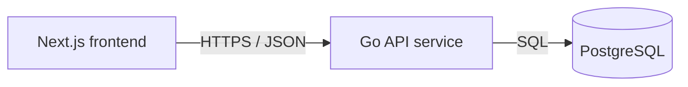

# Service & Interface Design — Todo List App v4

Last updated: 2026-08-12
Source: `docs/todos/SRS.md`, `docs/architecture/erd.md`, `docs/architecture/overview.md`

## 1. Service map



| Service | Responsibility | Owns (tables) | Depends on | Deploy unit |
|---|---|---|---|---|
| Todo API service | Validate todo requests, persist tasks, expose JSON API, run migrations, provide health status. | `todos`, `schema_migrations` | PostgreSQL | `code/backend` container |
| Next.js frontend | Render single todo page and call Todo API. Owns no data tables. | none | Todo API service | `code/frontend` container |

**Why these boundaries** — single backend service: no boundary justified yet. Todo app has one owner, one deploy cadence, one data aggregate, and no independent scaling need.

## 2. Cross-cutting contract

### 2.1 Base

- Base URL: `{scheme}://{host}/api/v1`
- Content type: `application/json; charset=utf-8`
- Versioning: URL path major version. A new major version only for breaking changes.
- Trace header: `X-Request-Id` accepted from caller, generated if absent, echoed on every response and present in every log line.
- JSON naming: `snake_case`.
- IDs: strings on wire, UUID format.
- Timestamps: RFC 3339 UTC.
- Request body cap: 16 KiB for todo write endpoints.

### 2.2 Authentication and authorization

| Aspect | Decision |
|---|---|
| Mechanism | None. SRS says no login and no per-user permissions. |
| Token lifetime | n/a |
| Refresh | n/a |
| Transport | No `Authorization` header required or consumed. |
| Roles | Public user only. |
| Enforcement point | API router allows all todo endpoints; per-resource authorization is not applicable because app has one shared list. |

### 2.3 Error contract

Every non-2xx response from every `/api/v1` endpoint has this shape:

```json
{
  "error": {
    "code": "VALIDATION_FAILED",
    "message": "Human-readable summary, safe to show a user.",
    "details": [
      { "field": "title", "code": "TOO_LONG", "message": "Title must be 200 characters or fewer." }
    ],
    "request_id": "01HXEXAMPLE"
  }
}
```

Consumers branch on `code`. `message` is display text and may be reworded at any time without notice. `details` may be empty but is always present.

**Error catalog** — closed set for this project.

| Code | HTTP | Meaning | Retryable |
|---|---|---|---|
| `BAD_REQUEST` | 400 | Malformed JSON, wrong JSON type, unknown request shape, or invalid query type. | no |
| `VALIDATION_FAILED` | 422 | Well-formed request failed semantic validation, such as title length outside 1–200 after trimming. | no |
| `NOT_FOUND` | 404 | Todo does not exist. | no |
| `RATE_LIMITED` | 429 | Too many requests; response includes `Retry-After`. | yes |
| `INTERNAL` | 500 | Unexpected failure; details logged, not returned. | yes |
| `UNAVAILABLE` | 503 | Database unavailable, migration not complete, or server shutting down. | yes |

No `UNAUTHENTICATED` or `PERMISSION_DENIED` codes exist in v1 because app has no auth.

### 2.4 Pagination

Todo list is small but grows and can be written concurrently, so cursor pagination is project-wide scheme for collections. UI may request max limit to show current shared list.

```text
GET /api/v1/todos?limit=100&cursor=eyJjcmVhdGVkX2F0IjoiMjAyNi0wOC0xMlQxMDowMDowMFoiLCJpZCI6IjAxOTg5YjY0LTAwMDAtNzAwMC04MDAwLTAwMDAwMDAwMDAwMSJ9
```

```json
{
  "data": [
    {
      "id": "01989b64-0000-7000-8000-000000000001",
      "title": "Buy milk",
      "is_completed": false,
      "created_at": "2026-08-12T10:00:00Z",
      "updated_at": "2026-08-12T10:00:00Z"
    }
  ],
  "next_cursor": null,
  "has_more": false
}
```

| Aspect | Decision |
|---|---|
| Style | Cursor |
| Default limit | 100 |
| Max limit | 100 |
| Default sort | `created_at ASC, id ASC`; stable and unique |
| Cursor contents | Base64url JSON containing `created_at` and `id`; opaque to clients |
| Empty result | `data: []`, `next_cursor: null`, `has_more: false` |

### 2.5 Validation boundary

Validation boundary is Go API HTTP handler layer before repository calls. It validates method, content type, body size, JSON syntax, field presence, field types, UUID path params, title trim/length, boolean values, query limit range, and cursor format. Downstream service/repository code may trust typed validated inputs and still handles database errors defensively.

### 2.6 Idempotency

No v1 write endpoint accepts `Idempotency-Key`. Rationale: duplicate todo titles are valid, create must allow repeated same title, and frontend disables duplicate in-flight actions per SRS. DELETE is HTTP-idempotent by method semantics. PATCH is last-write-wins for `is_completed`.

| Endpoint | Idempotency behavior |
|---|---|
| `POST /api/v1/todos` | Not idempotent. Retrying after unknown network failure can create a duplicate task. Frontend should only retry on explicit user action. |
| `PATCH /api/v1/todos/{todo_id}` | Not idempotent by key, but setting same `is_completed` value repeatedly returns same persisted state while row exists. |
| `DELETE /api/v1/todos/{todo_id}` | Idempotent. Deleting existing row returns 204; deleting already absent row returns 204 so rapid duplicate delete does not surface duplicate errors. |

## 3. Endpoints

### 3.1 `GET /api/v1/todos`

**Purpose** — List saved tasks in stable created order for page load and retry. **Traces to** — TODOS-001, TODOS-002, TODOS-003, TODOS-004, TODOS-005. **Auth** — public.

**Path / query parameters**

| Name | In | Type | Required | Constraints | Description |
|---|---|---|---|---|---|
| `limit` | query | integer | no | 1–100; default 100 | Maximum tasks returned. |
| `cursor` | query | string | no | Opaque cursor previously returned by this endpoint | Starts result after cursor position. |

**Request body**

None. Body must be absent.

**Success response** — `200`

```json
{
  "data": [
    {
      "id": "01989b64-0000-7000-8000-000000000001",
      "title": "Buy milk",
      "is_completed": false,
      "created_at": "2026-08-12T10:00:00Z",
      "updated_at": "2026-08-12T10:00:00Z"
    }
  ],
  "next_cursor": null,
  "has_more": false
}
```

| Field | Type | Nullable | Description |
|---|---|---|---|
| `data` | array of todo objects | no | Tasks ordered by `created_at ASC, id ASC`. |
| `data[].id` | string UUID | no | Todo identifier. |
| `data[].title` | string | no | Trimmed title, 1–200 characters. |
| `data[].is_completed` | boolean | no | Completion state. |
| `data[].created_at` | string timestamp | no | Creation time in RFC 3339 UTC. |
| `data[].updated_at` | string timestamp | no | Last update time in RFC 3339 UTC. |
| `next_cursor` | string | yes | Cursor for next page, or null when no next page. |
| `has_more` | boolean | no | True when another page exists. |

**Errors** — every code this endpoint can return. No others.

| Code | HTTP | Trigger |
|---|---|---|
| `BAD_REQUEST` | 400 | `limit` is not an integer, cursor cannot be decoded, cursor lacks required fields, or request body is present. |
| `RATE_LIMITED` | 429 | Caller exceeds rate limit. |
| `INTERNAL` | 500 | Unexpected server error. |
| `UNAVAILABLE` | 503 | Database unavailable or server shutting down. |

**Notes** — No side effects. No retries from API to DB beyond one SQL call; caller retry is safe because GET is idempotent. Frontend shows loading state until response, error state with retry on failure.

### 3.2 `POST /api/v1/todos`

**Purpose** — Create one persisted incomplete todo from trimmed non-empty title. **Traces to** — TODOS-002, TODOS-005. **Auth** — public.

**Path / query parameters**

None.

**Request body**

```json
{
  "title": "Buy milk"
}
```

| Field | Type | Required | Constraints | Description |
|---|---|---|---|---|
| `title` | string | yes | Trimmed server-side; 1–200 characters after trim | Task title to store. Duplicate titles allowed. |

**Success response** — `201`

Header: `Location: /api/v1/todos/{todo_id}`

```json
{
  "id": "01989b64-0000-7000-8000-000000000001",
  "title": "Buy milk",
  "is_completed": false,
  "created_at": "2026-08-12T10:00:00Z",
  "updated_at": "2026-08-12T10:00:00Z"
}
```

| Field | Type | Nullable | Description |
|---|---|---|---|
| `id` | string UUID | no | New todo identifier. |
| `title` | string | no | Stored trimmed title. |
| `is_completed` | boolean | no | Always false for new todo. |
| `created_at` | string timestamp | no | Creation time in RFC 3339 UTC. |
| `updated_at` | string timestamp | no | Same as creation time on insert. |

**Errors** — every code this endpoint can return. No others.

| Code | HTTP | Trigger |
|---|---|---|
| `BAD_REQUEST` | 400 | Body missing, malformed JSON, non-object JSON, `title` missing, `title` not string, unknown top-level field, or body exceeds 16 KiB. |
| `VALIDATION_FAILED` | 422 | Trimmed title length is 0 or greater than 200 characters. |
| `RATE_LIMITED` | 429 | Caller exceeds rate limit. |
| `INTERNAL` | 500 | Unexpected server error. |
| `UNAVAILABLE` | 503 | Database unavailable or server shutting down. |

**Notes** — Not idempotent. API trims leading/trailing whitespace before insert. Database constraints backstop trim and length rules. No duplicate check; same title creates separate task. Frontend clears input only after 201.

### 3.3 `PATCH /api/v1/todos/{todo_id}`

**Purpose** — Persist completion state for one existing todo. **Traces to** — TODOS-003, TODOS-005. **Auth** — public.

**Path / query parameters**

| Name | In | Type | Required | Constraints | Description |
|---|---|---|---|---|---|
| `todo_id` | path | string UUID | yes | Valid UUID | Target todo identifier. |

**Request body**

```json
{
  "is_completed": true
}
```

| Field | Type | Required | Constraints | Description |
|---|---|---|---|---|
| `is_completed` | boolean | yes | `true` or `false` only | New completion state. |

**Success response** — `200`

```json
{
  "id": "01989b64-0000-7000-8000-000000000001",
  "title": "Buy milk",
  "is_completed": true,
  "created_at": "2026-08-12T10:00:00Z",
  "updated_at": "2026-08-12T10:01:00Z"
}
```

| Field | Type | Nullable | Description |
|---|---|---|---|
| `id` | string UUID | no | Todo identifier. |
| `title` | string | no | Stored trimmed title. |
| `is_completed` | boolean | no | Persisted completion state after update. |
| `created_at` | string timestamp | no | Creation time in RFC 3339 UTC. |
| `updated_at` | string timestamp | no | Update time in RFC 3339 UTC. |

**Errors** — every code this endpoint can return. No others.

| Code | HTTP | Trigger |
|---|---|---|
| `BAD_REQUEST` | 400 | `todo_id` is not UUID, body missing, malformed JSON, non-object JSON, `is_completed` missing, `is_completed` not boolean, unknown top-level field, or body exceeds 16 KiB. |
| `NOT_FOUND` | 404 | No todo exists with `todo_id`. |
| `RATE_LIMITED` | 429 | Caller exceeds rate limit. |
| `INTERNAL` | 500 | Unexpected server error. |
| `UNAVAILABLE` | 503 | Database unavailable or server shutting down. |

**Notes** — Last-write-wins. No server-side toggle endpoint because explicit desired state is harder to misuse under rapid action. Frontend prevents duplicate in-flight save for same task and reverts visible state on failure.

### 3.4 `DELETE /api/v1/todos/{todo_id}`

**Purpose** — Permanently delete one todo. **Traces to** — TODOS-004, TODOS-005. **Auth** — public.

**Path / query parameters**

| Name | In | Type | Required | Constraints | Description |
|---|---|---|---|---|---|
| `todo_id` | path | string UUID | yes | Valid UUID | Target todo identifier. |

**Request body**

None. Body must be absent.

**Success response** — `204`

No body.

| Field | Type | Nullable | Description |
|---|---|---|---|
| n/a | n/a | n/a | No response body. |

**Errors** — every code this endpoint can return. No others.

| Code | HTTP | Trigger |
|---|---|---|
| `BAD_REQUEST` | 400 | `todo_id` is not UUID or request body is present. |
| `RATE_LIMITED` | 429 | Caller exceeds rate limit. |
| `INTERNAL` | 500 | Unexpected server error. |
| `UNAVAILABLE` | 503 | Database unavailable or server shutting down. |

**Notes** — Idempotent. If row is already absent, return 204. This matches SRS not-found delete behavior: task absent and page does not crash. Hard delete only; no recovery, undo, audit, or soft delete in v1.

## 4. Asynchronous work

No jobs, queues, schedules, or events in v1.

| Name | Trigger | Payload | Retry | Backoff | Dead letter | Idempotent |
|---|---|---|---|---|---|---|
| none | n/a | n/a | n/a | n/a | n/a | n/a |

## 5. External integrations

No third-party integrations in v1. No secrets beyond `DATABASE_URL` already documented in `code/backend/.env.example`.

| System | Purpose | Protocol | Timeout | Retry | On failure | Secrets |
|---|---|---|---|---|---|---|
| PostgreSQL | Persist todo rows | SQL over pgx connection pool | 2s per query from request context | No automatic retry for writes; GET may be retried by caller | User sees recoverable storage/load error; request logs include `request_id` | `DATABASE_URL` |

## 6. Non-functional targets

| Aspect | Target |
|---|---|
| p95 latency (read) | ≤ 200ms API time for 100 tasks, excluding network |
| p95 latency (write) | ≤ 250ms API time, excluding network |
| Availability | Health endpoint returns non-200 while database unavailable or migrations fail |
| Rate limit | 120 requests per minute per IP for `/api/v1/*`; 20 writes per minute per IP |
| Payload cap | 16 KiB JSON body for write endpoints |
| Timeout (inbound) | 5s request context deadline for `/api/v1/*`; 2s database query timeout within it |
| Frontend feedback | Visual feedback within 100ms of user action before save settles |
| Motion | Non-essential animation ≤ 300ms and reduced for `prefers-reduced-motion` |

## 7. Observability

- Log fields present on every request line: `request_id`, `method`, `path`, `status`, `duration_ms`, `remote_addr`, `user_agent`, `error_code` when present.
- Metrics per endpoint: request rate, error count by code/status, duration histogram.
- Health logging: migration failure and database ping failure include internal error only in logs, keyed by `request_id` where applicable.
- Never logged: full request bodies, task titles, `DATABASE_URL`, tokens, passwords, stack traces in responses.

## 8. Contract evolution

| Change | Additive or breaking | Migration path |
|---|---|---|
| Add optional response field to todo object | Additive | Frontend ignores unknown fields. |
| Add optional query filter to `GET /api/v1/todos` | Additive if default behavior unchanged | Document param; old clients omit it. |
| Add new endpoint | Additive | No migration needed. |
| Change title max length | Breaking if tightened; additive if relaxed with DB migration | For tightening, add frontend validation first, reject new long titles after date, migrate or grandfather existing rows. |
| Change delete from hard delete to soft delete/undo | Breaking if response or persistence semantics change | Add new endpoint or optional undo contract; keep DELETE 204 semantics until clients migrate. |
| Add authentication or per-user lists | Breaking for data visibility and auth requirements | Introduce `/api/v2` or additive optional identity mode with explicit migration plan. |

## 9. Requirement traceability

| SRS requirement | Endpoint coverage |
|---|---|
| TODOS-001 | `GET /api/v1/todos` loads list, empty state data, loading/error retry behavior. |
| TODOS-002 | `POST /api/v1/todos` creates persisted task; `GET /api/v1/todos` proves persistence after refresh. |
| TODOS-003 | `PATCH /api/v1/todos/{todo_id}` persists completion; `GET /api/v1/todos` proves persistence after refresh. |
| TODOS-004 | `DELETE /api/v1/todos/{todo_id}` removes task; `GET /api/v1/todos` proves deletion and empty state after refresh. |
| TODOS-005 | All endpoints define validation, loading/error retry paths, write pending behavior, and rate/unavailable errors for UI feedback. |

## 10. Open questions

| Question | Owner | Blocking |
|---|---|---|
| Should deleted tasks be recoverable? Current SRS default is no; API uses permanent delete. | Stakeholder | no |
